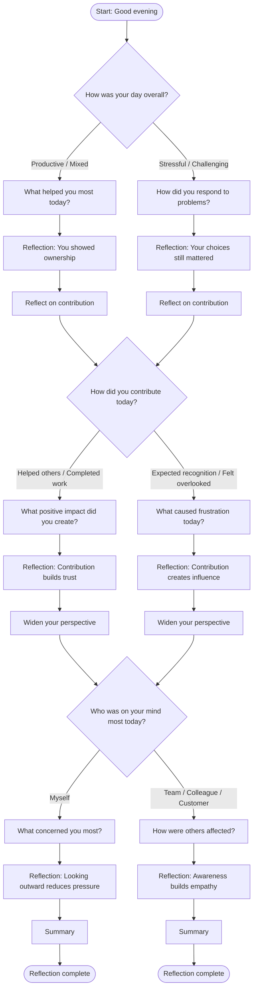

# Tree Diagram

```mermaid
flowchart TD

START([Start: Good evening]) --> A1_OPEN{How was your day overall?}

A1_OPEN -->|Productive / Mixed| A1_Q1[What helped you most today?]
A1_OPEN -->|Stressful / Challenging| A1_Q2[How did you respond to problems?]

A1_Q1 --> A1_R1[Reflection: You showed ownership]
A1_Q2 --> A1_R2[Reflection: Your choices still mattered]

A1_R1 --> B1[Reflect on contribution]
A1_R2 --> B2[Reflect on contribution]

B1 --> A2_OPEN{How did you contribute today?}
B2 --> A2_OPEN

A2_OPEN -->|Helped others / Completed work| A2_Q1[What positive impact did you create?]
A2_OPEN -->|Expected recognition / Felt overlooked| A2_Q2[What caused frustration today?]

A2_Q1 --> A2_R1[Reflection: Contribution builds trust]
A2_Q2 --> A2_R2[Reflection: Contribution creates influence]

A2_R1 --> B3[Widen your perspective]
A2_R2 --> B4[Widen your perspective]

B3 --> A3_OPEN{Who was on your mind most today?}
B4 --> A3_OPEN

A3_OPEN -->|Myself| A3_Q1[What concerned you most?]
A3_OPEN -->|Team / Colleague / Customer| A3_Q2[How were others affected?]

A3_Q1 --> A3_R1[Reflection: Looking outward reduces pressure]
A3_Q2 --> A3_R2[Reflection: Awareness builds empathy]

A3_R1 --> SUMMARY[Summary]
A3_R2 --> SUMMARY2[Summary]

SUMMARY --> END([Reflection complete])
SUMMARY2 --> END2([Reflection complete])
```
